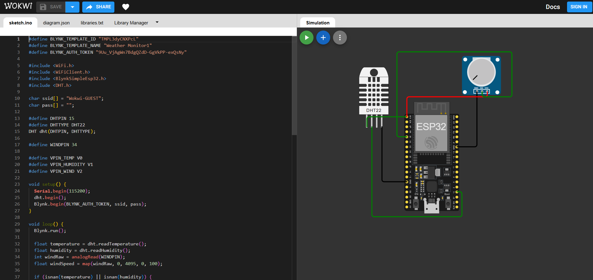

# 🌦️ IoT-Based Smart Weather Monitoring System

<p align="center">
  
  
  
</p>

## 📌 Project Overview

This project is a smart weather monitoring system that measures **temperature**, **humidity**, and **wind speed** in real-time using ESP32, DHT22, and a potentiometer (as a wind sensor). It is connected to the **Blynk IoT platform** for remote monitoring and notifications.

The system triggers **mobile alerts and email notifications** when any reading exceeds safe environmental thresholds, making it ideal for small-scale agricultural, academic, or smart-home applications.

---

## 🧰 Tech Stack

- **Microcontroller**: ESP32
- **Sensors**: DHT22 (Temp & Humidity), Potentiometer (Wind)
- **Connectivity**: Wi-Fi (Wokwi-GUEST), Blynk Cloud
- **Platform**: [Blynk IoT](https://blynk.io/)
- **Simulation**: [Wokwi](https://wokwi.com/)
- **Language**: C++ (Arduino Framework)

---

## 🛠️ Features

✅ Real-time measurement of temperature, humidity, and wind  
✅ Live sensor values sent to Blynk via Virtual Pins (V0, V1, V2)  
✅ Threshold-based alert system (Temperature > 35°C, Humidity > 80%, Wind > 60 km/h)  
✅ `logEvent()` sends push/email notifications using Blynk  
✅ Fully testable on Wokwi simulator

---

## 📸 Screenshots

<p align="center">
  
  
</p>

---

## 🚀 How to Run

### ✅ Prerequisites
- Blynk IoT Account
- Blynk Template ID, Name, and Auth Token
- Arduino IDE (or PlatformIO)
- Wokwi (for simulation) or real ESP32 board

### 🔌 Hardware Connections
| Component      | ESP32 Pin |
|----------------|-----------|
| DHT22          | GPIO 15   |
| Potentiometer  | GPIO 34   |

### 🧾 Code Snippet

```cpp
#define DHTPIN 15
#define DHTTYPE DHT22
#define WINDPIN 34

float temperature = dht.readTemperature();
float humidity = dht.readHumidity();
int windRaw = analogRead(WINDPIN);
float windSpeed = map(windRaw, 0, 4095, 0, 100);
